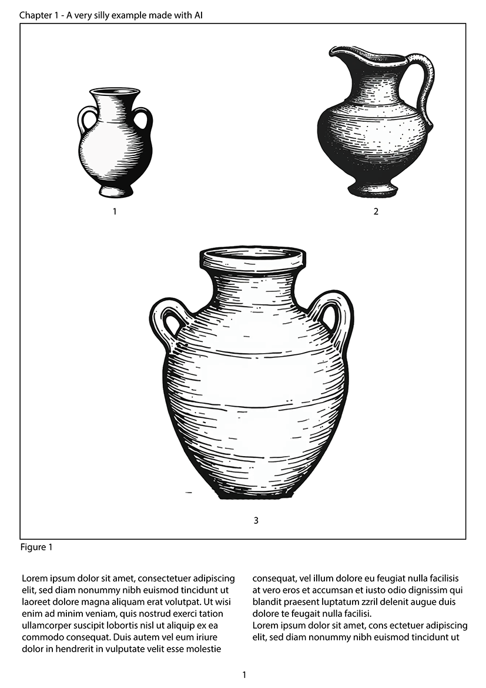
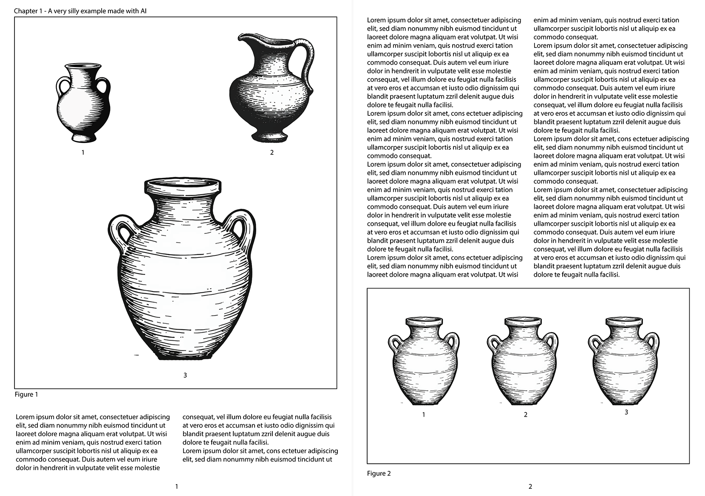
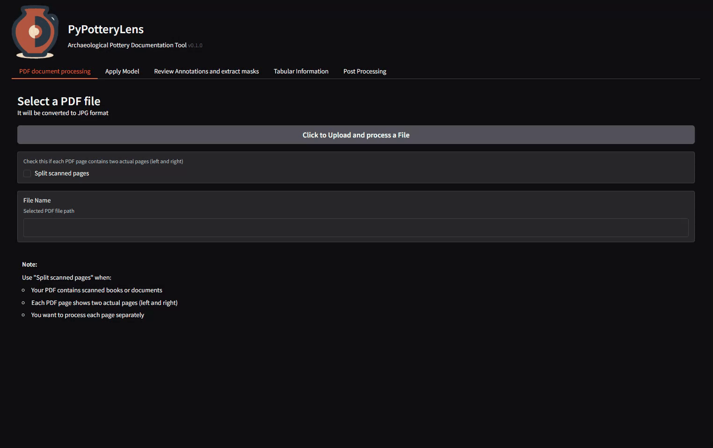
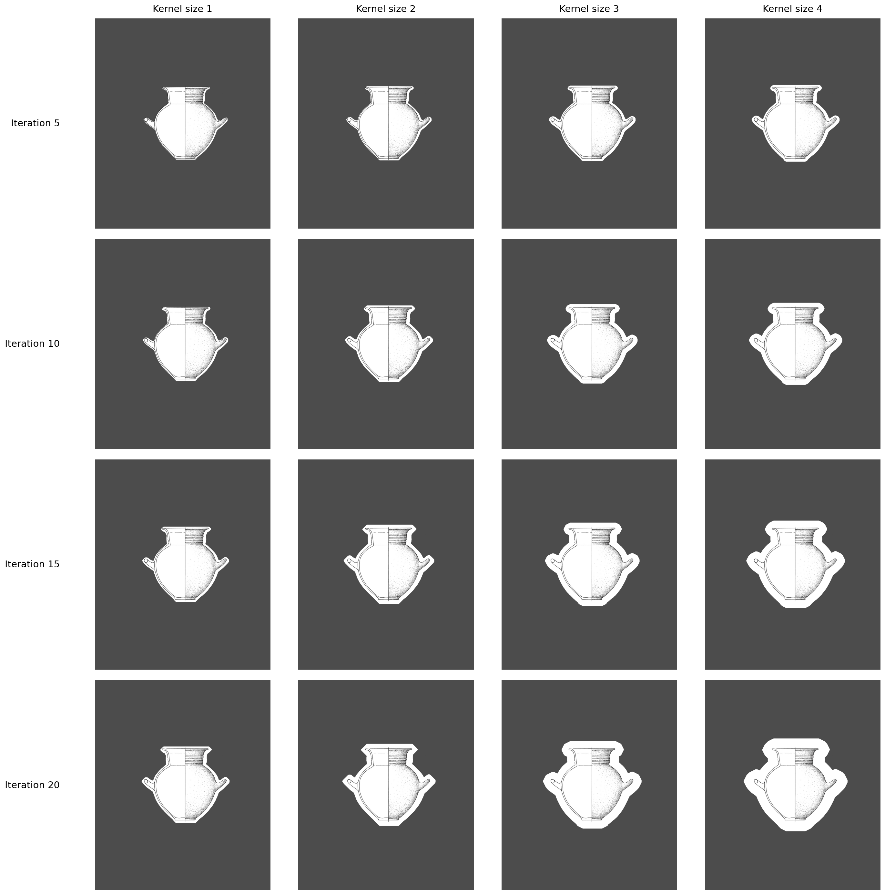
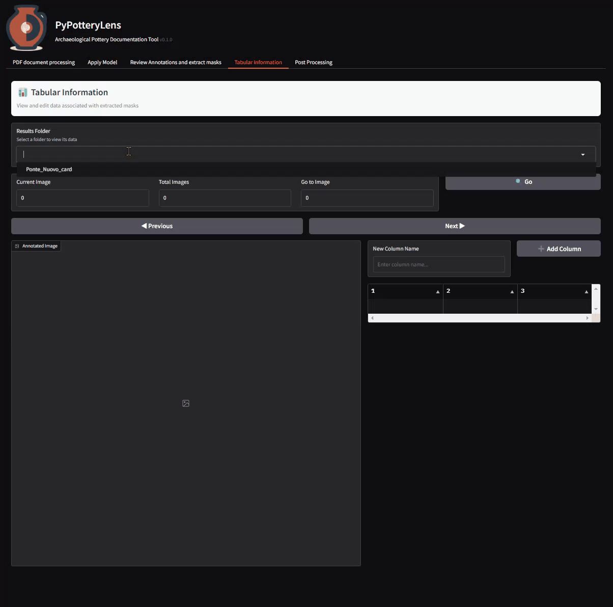

# `PyPotterLens`

<p align="center">

</p>
<p align="center">
Version: 0.1.0
</p>

As part of the **PyPottery** toolkit, `PyPotteryLens` is a Gradio desktop application for archaeological pottery drawings recording. It provides a comprehensive suite of tools for processing, detecting, and analyzing pottery fragments from scanned documents.

## Features

- **PDF Processing**: Convert multi-page PDF documents to high-quality images
- **Fragment Detection**: Computer vision model for automatic pottery drawings detection
- **Manual Annotation**: Interactive interface for reviewing and adjusting detected drawings
- **Tabular Data Management**: Add tabular data to the detected drawings
- **Post Processing**: Automatic classification of pottery drawings for a standardized recording
- **User-Friendly Interface**: Intuitive GUI built with Gradio

## Installation

### Quick Installation (Windows)

1. Download the releases ZIP and extract it in a folder of your choice.

2. Download Python 3.11 from [Microsoft Store](https://www.microsoft.com/store/productId/9NRWMJP3717K?ocid=pdpshare)

3. Double click on `PyPotteryLens_WIN.bat` file. This will open an installation process. A virtual environment (`venv`) will be created and all the dependencies will be installed automatically. If CUDA is available, it will be installed as well. During the installation, basic models will be downloaded from HuggingFace. Several progress bars keep you informed about the installation process.

4. After the installation is complete, the program will be executed and the default browser will open the GUI.

#### UNIX (Linux, MacOS)

1. Download the releases ZIP and extract it in a folder of your choice.

2. Open a terminal and move into the downloaded folder.

3. Run the following command:

   ```bash
   sh PyPotteryLens_UNIX.sh
   ```
   This will install the required dependencies and start the application.

### Manual Way (Windows, Linux, MacOS)

1. Download the repository ZIP

2. Move into the downloaded folder

3. Install the required dependencies:
   ```bash
   pip install -r requirements.txt
   ```

4. (***OPTIONAL***) For CUDA support (recommended for faster processing):
   - Install CUDA Toolkit (11.x or higher) from [NVIDIA's website](https://developer.nvidia.com/cuda-downloads)
   - Install PyTorch with CUDA support:

   ```bash
   # For CUDA 11.8
   pip install torch torchvision torchaudio --index-url https://download.pytorch.org/whl/cu118
   ```

5. Download the basic models from [HuggingFace](https://huggingface.co/lrncrd/PyPotteryLens/tree/main) and place them in to the `models_vision` (BasicModelv8_v01.pt) and `models_classifier` (model_classifier.pth).

   The project structure should look like this:

      ```
      pypotterylens/
      ├── app.py              # Main application file
      ├── utils.py            # Utility functions and processors
      ├── models.py           # Model definitions
      ├── models_vision/      # Detection models (create this folder and place the model here)
      ├── models_classifier/  # Classifier models (create this folder and place the model here)
      ├── outputs/            # Processing outputs
      ├── pdf2img_outputs/    # PDF conversion outputs
      ├── imgs/               # Application images
      └── requirements.txt    # Project dependencies
      ```

   The `models_vision` folder should look like this:

      ```
      models_vision/
      ├── BasicModelv8_v01.pt     # Main detection model
      └── [other_models].pt   # Additional detection models (if any)
      ```

   The `models_classifier` folder should look like this:

      ```
      models_classifier/
      ├── model_classifier.pth     # Main classifier model
      ```


   > ⚠️ **Important**: If you want to use CUDA, install first pytorch with CUDA support (**step 4**) and then the rest of the dependencies (**step 3**).


## Let's get started

If you have installed the program using the quick installation, click on `PyPotteryLens_WIN.bat` on Windows or run `sh PyPotteryLens_UNIX.sh` in the bash on Linux or MacOS. The script detect the existing virtual environment and run the program. 

If you have installed the program manually, run the following command:

```bash
python app.py # python3 app.py for Linux and MacOS
```

This will open the GUI in your default browser.

## Usage

During the start-up, some useful information is displayed in the console. Including Directory Structure status, CUDA availability, main package versions.

Here's the description of a typical workflow:

### 1. Upload a PDF

In the "PDF document processing" tab, you'll start your pottery analysis journey by importing your PDF. The process begins with the `Click to Upload and process a File` button, which opens a file selector where you can choose any PDF from your computer. You'll find a helpful option called `Split scanned pages` - this checkbox is particularly useful when working with scanned books where each PDF page actually contains two physical pages side by side.


<p align="center">

</p>
<p align="center">
One page layout
</p>
</p>

<p align="center">

<p align="center">
Two pages layout
</p>
</p>


> ⚠️ **Important**: When naming your PDF files, stick to a simple format without spaces or special characters. The recommended pattern is either `Author_Year.pdf` or `Context_Year.pdf`. For example:
> - `Cardarelli_2022.pdf`
> - `MonteCimino_2025.pdf`
> - `Veio_1963.pdf`
> This naming convention ensures smooth processing and helps maintain organized outputs.

After processing, you'll find your converted images in the `pdf2img_outputs` folder. The naming system is straightforward but differs depending on whether you used the split pages option:

For standard processing (Split pages unchecked):

- Files are named as `{Author_Year}_page_{PageNumber}.jpg`
- Example: `Cardarelli_2022_page_0.jpg` represents the first page of your document

For split processing (Split pages checked):

- Files are named as `{Author_Year}_page_{PageNumber}{side}.jpg`
- Example: `Cardarelli_2022_page_0a.jpg` represents the left side of the first page
- While `Cardarelli_2022_page_0b.jpg` represents the right side

<p align="center">

</p>


### 2. Apply the Model

In the "Apply Model" tab, you can run the computer vision model on your processed images. In the `📁 Input Selection` box, you'll find two key elements: a folder selector where you can choose the images to process (these will be in your `pdf2img_outputs` folder), and a `Model` dropdown menu that lets you select from the available models in the `models_vision` folder.

The `⚙️ Model Parameter` box contains three important settings that help you fine-tune the detection process:

- `Confidence Threshold` (0.1 to 1.0): This determines how certain the model needs to be before identifying something as a pottery instance. A higher value (like 0.8) means the model will only detect pottery it's very confident about, reducing false positives but potentially missing some harder-to-detect pieces. A lower value (like 0.3) will catch more pottery instances but might include some incorrect detections.

- `Kernel Size`: This parameter affects how the segmentation masks are processed after detection. A larger kernel size creates smoother, more rounded edges but might lose some fine details. A smaller kernel preserves more detail but might leave the edges rougher. Think of it like adjusting the "brush size" for cleaning up the detection borders.

- `Iterations`: This determines how many times the post-processing is applied to the masks. More iterations create more pronounced effects - useful for closing small gaps or smoothing rough edges, but too many iterations might alter the pottery's shape too much. Work with this parameter alongside the Kernel Size to find the right balance.

Here is an example of different `Kernel Size` and `Iterations` applied to a pottery instance:

<p align="center">

</p>

In the `🔧 Advanced Options` section, you'll find the `Diagnostic Mode` checkbox. When checked, it will only process the first 25 images in your folder, letting you quickly test your parameter settings without waiting for a full dataset to process. This is particularly helpful when you're fine-tuning the Model Parameters.

The right side of the page shows a gallery view of all the images waiting to be processed, helping you verify you've selected the correct folder and giving you a preview of what the model will work with.

When you're ready to process your images, click the `🚀 Apply Model` button. A progress bar will keep you informed as the model works through your images. The results are saved in a new folder called `{Author_Year}_mask` within the `outputs` directory, where you'll find your processed images with their segmentation masks visible.

<p align="center">

</p>


### 3. Review annotations and extract istances

In the "Review Annotations and extract masks" tab, you can carefully review the computer vision results and extract individual pottery instances. In the `📁 Input Selection` area, you'll need to select the folder containing your processed images (you'll find this in the `outputs` folder with the name `{Author_Year}_mask`). 

Once you select a folder, a `FileExplorer` component appears, displaying all the images available for review. Clicking on any file's name opens it in the annotation revision tool, where you'll see the results of the automatic detection. If the model has successfully identified pottery instances, they'll appear as semi-transparent grey overlays on the image - this is the segmentation mask that defines each pottery item.

The annotation revision tool provides a simple but effective set of editing options. At the bottom of the tool, you'll find two main instruments:

- A **brush** (🖌️) tool for adding to the mask
- An **eraser** (🧹) tool for removing parts of the mask

Both tools come with adjustable size sliders, letting you fine-tune them for precise work. If you need to adjust your view of the whole interface, you can use the slider in the `📐 Editor Size` box to resize the annotation revision tool itself.

> 📝 **Note**: The current version of the brush tool doesn't support transparency, which means you won't be able to see the original image through your brush strokes while drawing. We're working on adding this feature in a future update to improve the editing experience.

Once you're satisfied with your annotations, the `📤 Extract Masks` button becomes your key to generating individual pottery instances. Clicking this button processes your annotations and saves the results in a new folder called `{Author_Year}_card` within the `outputs` directory. Each pottery instance gets its own image file, following a consistent naming pattern: `{Author_Year}_page_mask_layer_{InstanceNumber}.png`. 

For instance, if you're working with a document called `Cardarelli_2022.pdf`, the first extracted instance would be saved as `Cardarelli_2022_page_mask_layer_0.jpg`.

> 💡 **Tip**: It's good practice to review a few extracted instances after processing to ensure the masks are clean and accurate. This can save time in later processing stages.


<p align="center">

</p>

### 4. Tabular information

In the "Tabular Information" tab, you can select the folder containing the images processed in the previous step (in the `outputs` folder: `{Author_Year}_card`). On the left side of the page, you'll see an Annotated Image component that displays both the original image and highlighted bounding boxes around each pottery instance. 

Navigation between images is straightforward using the Previous and Next buttons, allowing you to move through your dataset efficiently.
At the bottom of the page, you'll find controls that let you focus on specific instances - when you select an instance, the Annotated Image component will automatically highlight just that piece, making it easier to verify details. This feature is particularly helpful when working with pages containing multiple pottery items.

On the right side of the page, you'll find the heart of the data management system - an interactive table component. When you first start, this table will contain just the basic ID for each instance on the page, but it's fully customizable to your needs. Adding new columns is simple: just type the desired column name in the "New Column Name" text box and click the Add Column button. The new column appears immediately in your table, ready for data entry.
Data entry is straightforward - simply click on any cell in the table and type your value. One of the most convenient features is that every change you make is saved automatically, so you never have to worry about losing your work. All this information is stored in a CSV file called `mask_info.csv`, which you can find in the outputs folder.


> ⚠️ **Important Note**: When entering data, remember to avoid using commas in your values, as this can cause issues with the CSV file format. If you need to work with complex data or make bulk edits, you can always open the CSV file in Excel or Google Sheets.


<p align="center">

</p>

### 5. Post Processing

In the "Post Processing" tab, you can select the folder containing the images processed in the previous step (in the `outputs` folder: `{Author_Year}_card`). This tab is designed to help you standardize the orientation and classification of your pottery instances. In the `Processing Options` box, you'll find two powerful automatic processing options:

- `Auto Vertical Flip`: This feature automatically detects and corrects instances where the pot's mouth is facing downward, flipping them to maintain a consistent upward orientation.
- `Auto Horizontal Flip`: Similarly, this option ensures all pottery profiles are oriented to the left side of the image, maintaining consistency across your dataset.

The Action box contains several important tools. The `Process All Images` button applies your selected processing options to every image in the folder at once - a real time-saver when working with large collections. On the right side of the page, you can compare the original and processed versions of each image side by side, making it easy to verify the results. Navigation buttons let you move through your collection smoothly.

Sometimes the automatic processing might not get things quite right - that's why we've included manual correction tools. If you notice any orientation issues, you can easily fix them using the `Flip Vertical` and `Flip Horizontal` buttons. You can also update the classification of each pot between complete (ENT) and fragmentary (FRAG) using the `Type` dropdown menu. Don't worry about saving - every change you make is automatically stored.

All processed images are saved in a new folder called `{Author_Year}_transformed_card` within the `outputs` folder. Once you're happy with the processing, you can use the `Merge Annotations` button in the Action box to combine your type classifications with the tabular information from your `mask_info.csv` file. This creates a comprehensive record in a new file called `merged_annotations.csv`.

The final step is exporting your results, which you can initiate by clicking the `📦 Export Results` button. This opens the `📦 Export Options` dialog, where you can customize your export. One key feature is the ability to assign an acronym to your dataset - for example, using "CRD" would name your files sequentially as `CRD_0.png`, `CRD_1.png`, and so on. For documentation purposes, you can also generate a PDF catalog - just check the Generate PDF Catalog box, select your preferred format (A4, A3, A5, Letter, or Legal), and adjust the Image Scale Factor to ensure your pottery fits perfectly on the page. All exported files are saved in a new folder named after your chosen acronym within the `outputs` directory.

<p align="center">

</p>

## Dependencies

Key dependencies include:

- gradio
- torch
- PyMuPDF
- ultralytics
- pandas
- PIL
- scikit-image

Full list available in `requirements.txt`

## Version History

- 0.1
  - Initial Release

## Contributors

- Lorenzo Cardarelli
