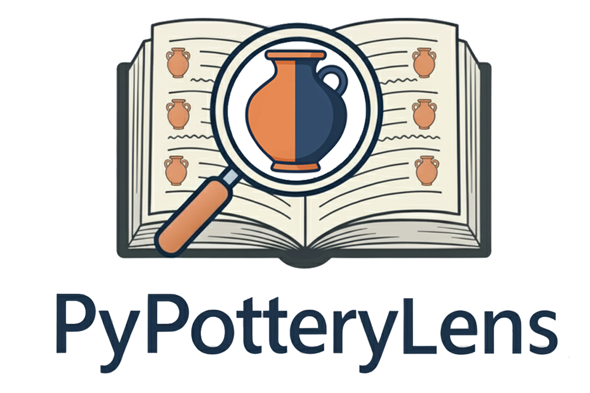

# PyPotteryLens

<div align="center">



[](https://www.python.org/downloads/)
[](LICENSE)
[](https://github.com/lrncrd/PyPotteryLens)
[](https://github.com/lrncrd/PyPotteryLens)
[](https://huggingface.co/lrncrd/PyPotteryLens)
[](https://arxiv.org/abs/2412.11574)
[](https://www.sciencedirect.com/science/article/pii/S2212054825000542)

Extract, annotate and catalogue pottery drawings from scanned PDFs

</div>

---

## Introduction

As part of the [**PyPottery**](https://github.com/lrncrd/PyPottery) toolkit, **PyPotteryLens** is a Flask-based web application for recording archaeological pottery drawings. It provides tools for processing, detecting and analyzing pottery drawings from scanned documents, with an intuitive web interface and a project-based workflow.

## ✨ Features

- **Project Management**: every archaeological dataset gets its own workspace with dedicated folders and metadata tracking
- **PDF Processing**: convert multi-page PDFs to high-quality images, with support for split-page scanning
- **Drawing Detection**: YOLO-based computer vision model with customizable confidence thresholds
- **Interactive Annotation Review**: canvas editor with brush, eraser, zoom/pan and a colorize mode to spot fused mask regions
- **Nested Vessel Handling**: polygon tool to outline vessels drawn inside other vessels; inner areas are subtracted from the outer card
- **Tabular Data Management**: integrated spreadsheet with AI-assisted extraction, canonical column names and per-drawing crop mode for small inventory numbers
- **Post Processing**: grid of all pieces at real relative size, automatic orientation and ENT/FRAG classification
- **Export**: standardized ZIP with images and merged metadata CSV, named with your own acronym
- **Auto-save**: progress is saved automatically

## 🚀 Quick Start

### Option 1 — PyPottery Suite Launcher (recommended)

The easiest way to get started, no Python installation required.

<p align="center">
  <a href="https://github.com/lrncrd/PyPottery/releases/latest">
    
  </a>
</p>

1. Grab the installer for your OS from [Releases](https://github.com/lrncrd/PyPottery/releases/latest)
2. Run it (Windows) or drag-to-Applications (macOS) — no Python install required
3. Launch PyPotteryLens from the suite launcher; updates are handled automatically

### Option 2 — Manual installation (from source)

For developers, or anyone who wants to run the app on its own:

```bash
# Clone repository
git clone https://github.com/lrncrd/PyPotteryLens.git
cd PyPotteryLens

# Install dependencies (includes PyTorch)
pip install -r requirements.txt

# Run the app
python app.py
# Then open http://127.0.0.1:5001 in your browser
```

Required models are downloaded from [HuggingFace](https://huggingface.co/lrncrd/PyPotteryLens) on first launch. For CUDA-specific PyTorch builds, older macOS versions and other platform notes, see the [Getting Started guide](https://lrncrd.github.io/PyPottery/pypotterylens/index.html). One-step installer scripts are also provided: `PyPotteryLens_WIN.bat` and `PyPotteryLens_UNIX.sh`.

## 📋 System Requirements

- **Python**: 3.10–3.12 (3.12 tested)
- **Operating System**: Windows 11, Ubuntu 24.10, macOS Sonoma 14 or later
- **Memory**: 8GB RAM minimum (16GB recommended)
- **GPU** (optional): NVIDIA with CUDA, or Apple Silicon (MPS) for faster processing; CPU works for small and medium datasets

## 🎯 Usage

1. **Create a project** and upload a PDF
2. **Apply the detection model** to find pottery drawings automatically
3. **Review & refine** the masks in the annotation editor
4. **Add metadata** in the tabular interface (optionally AI-assisted)
5. **Post-process**: auto-orient and classify pieces (ENT / FRAG)
6. **Export** the standardized ZIP

For the full walkthrough, see the **[Usage Guide](https://lrncrd.github.io/PyPottery/pypotterylens/usage.html)**. Having trouble? Check the troubleshooting section of the [Getting Started guide](https://lrncrd.github.io/PyPottery/pypotterylens/index.html#troubleshooting).

## 📊 What's New

See the **[Version History](https://lrncrd.github.io/PyPottery/pypotterylens/version_history.html)** for the full changelog.

**Roadmap**: light/dark mode toggle, executable packaging for easy distribution, automatic layout detection for tabular data.

## 📖 Citation

If you use PyPotteryLens in your research, please cite:

```bibtex
@article{cardarelli2024pypotterylens,
  title={PyPotteryLens: An Open-Source Deep Learning Framework for Automated Digitisation of Archaeological Pottery Documentation},
  author={Cardarelli, Lorenzo},
  journal={arXiv preprint arXiv:2412.11574},
  year={2024}
}
```

## 🤝 Contributing

Contributions are welcome: report bugs with reproduction steps, suggest features, improve the documentation, test on different platforms, or open a pull request from a feature branch.

## 👥 Contributors

<a href="https://github.com/lrncrd/PyPotteryLens/graphs/contributors">
  
</a>

## ☕ Support This Project

If you find PyPotteryLens useful for your research, consider supporting its development:

[](https://ko-fi.com/lrncrd)

Your support helps maintain and improve this open-source tool for the archaeological community!

---

Developed with ❤️ by [Lorenzo Cardarelli](https://github.com/lrncrd)
